# LATAM — Inflación ↔ PIB usando Random Forest

Proyecto reproducible con datos del Banco Mundial.

Se crean features (rezagos y diferencias), se valida temporalmente y se evalúa con hold-out.


## Países incluidos

ARG, BRA, CHL, COL, MEX, PER

## Resultados (RMSE/R² en hold-out)

- **COL** → RMSE=5.166 | R²=0.296
- **MEX** → RMSE=2.644 | R²=0.722
- **BRA** → RMSE=1.823 | R²=0.582
- **CHL** → RMSE=4.736 | R²=0.279
- **PER** → RMSE=6.476 | R²=0.310
- **ARG** → RMSE=3.515 | R²=0.742

## Visualizaciones

### ARG — Series de tiempo: Inflación y PIB


### ARG — Relación Inflación ↔ PIB


### ARG — Hold-out: Real vs Predicho


### ARG — RMSE (hold-out)


### BRA — Series de tiempo: Inflación y PIB


### BRA — Relación Inflación ↔ PIB

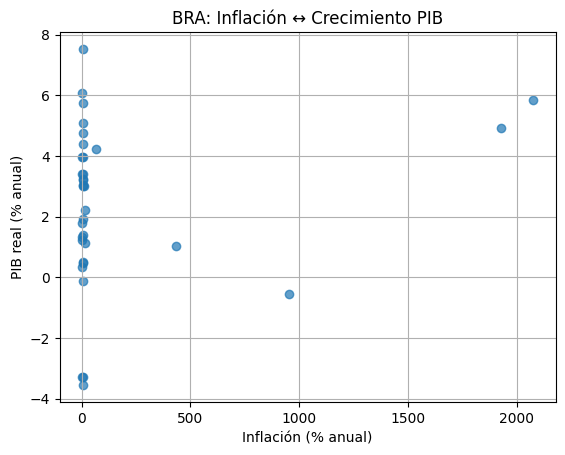

### BRA — Hold-out: Real vs Predicho

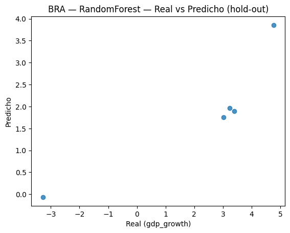

### BRA — RMSE (hold-out)

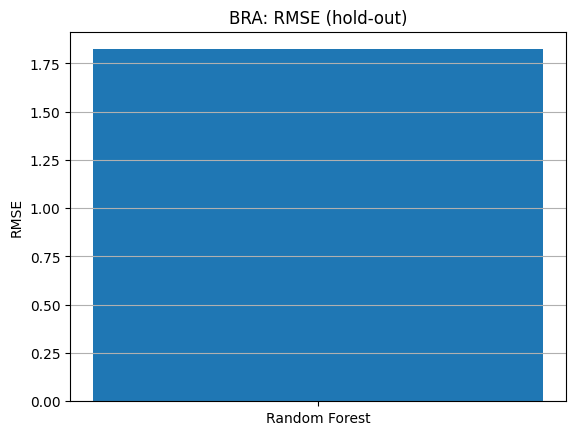

### CHL — Series de tiempo: Inflación y PIB


### CHL — Relación Inflación ↔ PIB


### CHL — Hold-out: Real vs Predicho

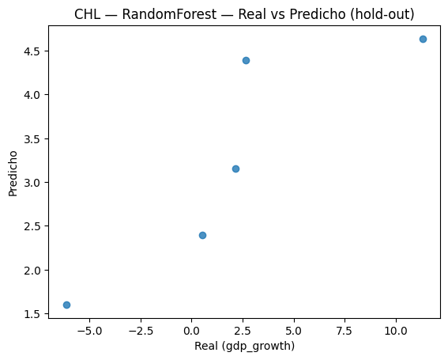

### CHL — RMSE (hold-out)

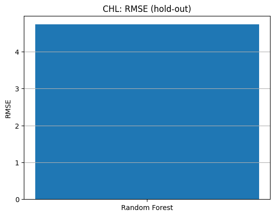

### COL — Series de tiempo: Inflación y PIB

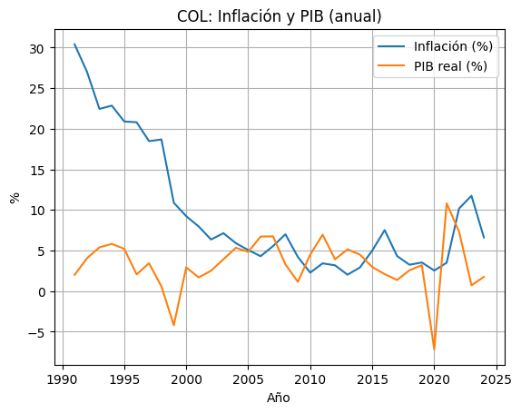

### COL — Relación Inflación ↔ PIB


### COL — Hold-out: Real vs Predicho

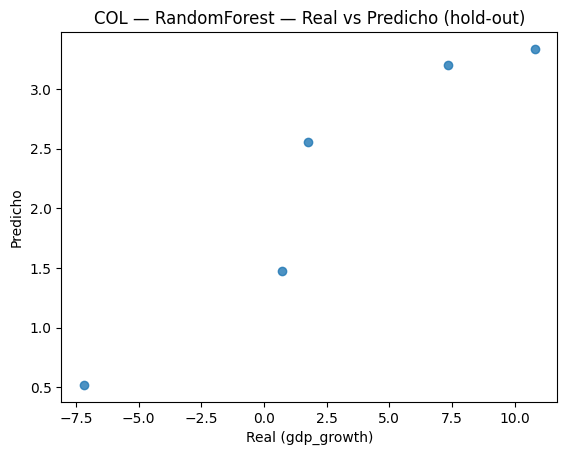

### COL — RMSE (hold-out)

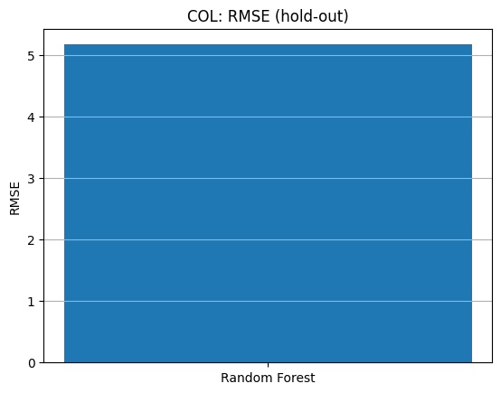

### MEX — Series de tiempo: Inflación y PIB


### MEX — Relación Inflación ↔ PIB

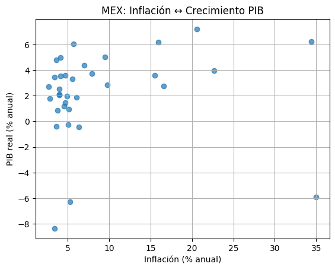

### MEX — Hold-out: Real vs Predicho


### MEX — RMSE (hold-out)

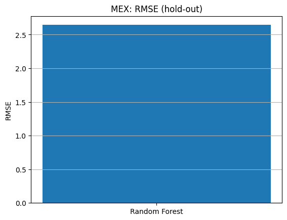

### PER — Series de tiempo: Inflación y PIB

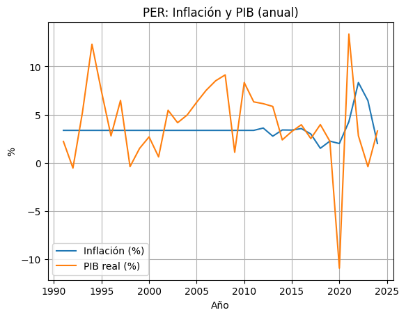

### PER — Relación Inflación ↔ PIB

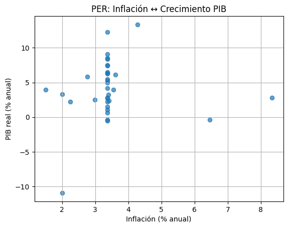

### PER — Hold-out: Real vs Predicho

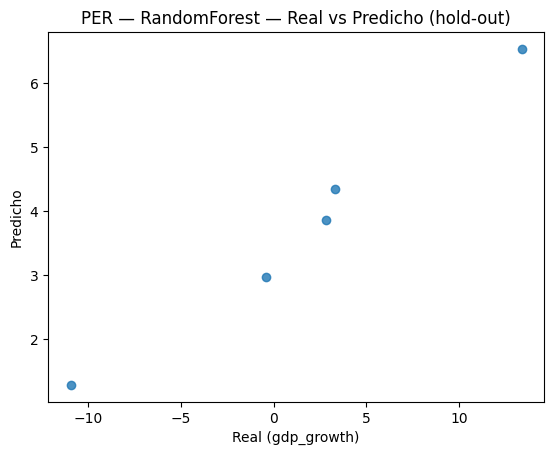

### PER — RMSE (hold-out)


## Cómo reproducir

```bash
pip install -r requirements.txt
python main.py fetch --countries COL MEX BRA CHL PER ARG --start_year 1991
python main.py bench --countries COL MEX BRA CHL PER ARG
python main.py report
```